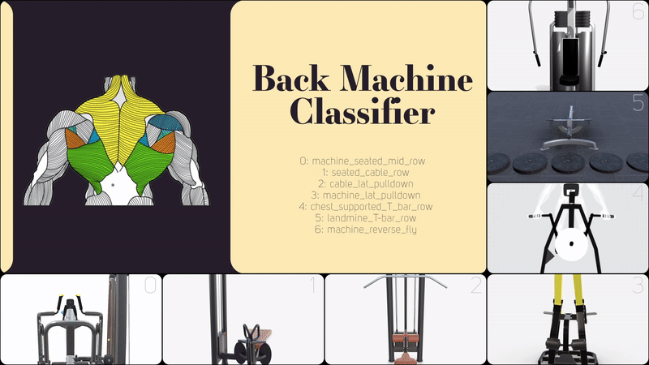

<h1>Gym Back Machine Detector</h1>

Build a gym back machine classifier using datasets of images from Google images, TikTok, Bilibili, Youtube videos, and Roboflow & Kaggle datasets. 

<h3>Built With</h3>

+ [Python](https://www.python.org/downloads/)
+ [Ultralytics YOLOv8](https://github.com/ultralytics/ultralytics)
+ Manual labeling is done using [AnyLabeling](https://anylabeling.nrl.ai/) v0.3.3 and then converted to YOLO format.
  
 <h3>About the Dataset</h3>
 
The dataset consists of 7 back gym Machines. Although there was some off-the-shelf dataset usage, most of the images were manually collected throughout the internet due to the unavailability of a decent sample size for most of the machines. However, whenever a dataset that already includes one of the classes is found, the class is extracted from the dataset and added to the training of the model. 
 
|         | Excercises | Machine seated mid row {0} | Seated cable row {1} | Cable lat pulldown {2} | Machine lat pulldown {3} | Chest supported T-bar row {4} | Landmine T-bar row {5} | Machine reverse fly {6} |
|---------|------------|-------------------------------|------------------|-------------------|----------------------|--------------------------|--------------------|----------------------|
| Dataset | Train      | 511                           | 712              | 989               | 376                  | 352                      | 331                | 425                  |
|         | Val        | 49                            | 69               | 83                | 30                   | 30                       | 32                 | 41                   |
|         | Test       | 50                            | 147              | 57                | 44                   | 61                       | 87                 | 55                   |
| Total   |            | 610                           | 928              | 1129              | 450                  | 443                      | 450                | 521                  |

<h3>Results</h3>

| Model                                                                                 | mAPval 50 | mAPval 50-95 | Test Accuracy |
| ------------------------------------------------------------------------------------- | ----------------- | -------------------- | ------------- |
| YOLOv8 nano (from scratch)                                                          | 0.95399           | 0.74986              | ?         |
| [YOLOv8 medium](https://github.com/ultralytics/assets/releases/download/v0.0.0/yolov8m.pt) | 0.96725           | 0.80451              | 0.84         |

<h5>Pretrained model results on video:</h5>

https://github.com/Masterx3/Back-Machine-Detector/assets/83991104/efc1ff09-4964-42e5-bb87-f7638a85f25a

For nano model validation metrics, check [[1]](./runs/detect/train4/).

For medium pre-trained model validation metrics, check [[2]](./runs/detect/train3/).

<h3>Contact Me</h3>

[Linkedin](https://www.linkedin.com/in/dahshory/)

<h3>Acknowledgements</h3>

Thanks to [Samir Gouda](github.com/SamirGouda) & [Omar Eldahshoury](github.com/omareldahshoury) for thier support.
